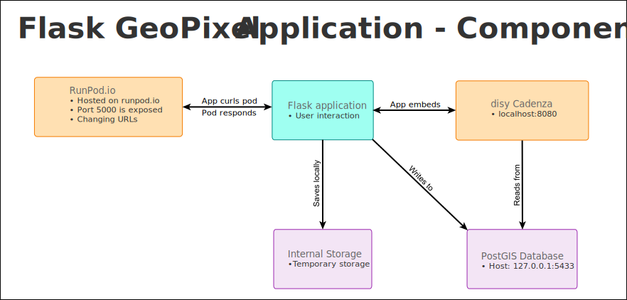
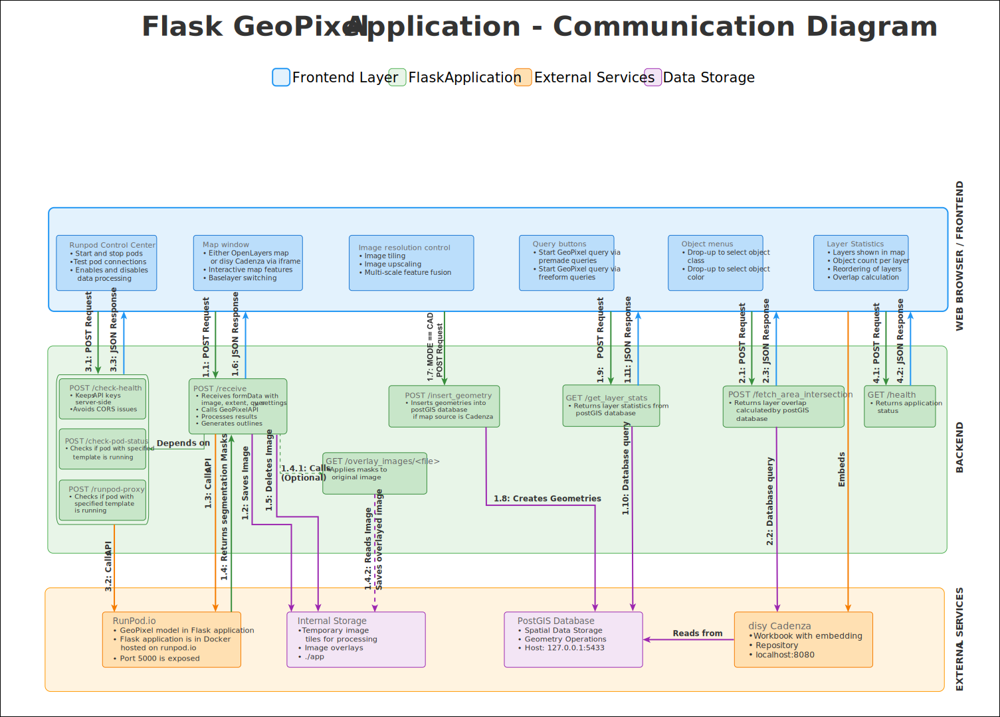

# Flask GeoPixel Application

## Communication Diagram
Integration of Geopixel into a Flask application offering both OpenLayers and disy Cadenza functionality.

The following diagram illustrates the communication flow and architecture of the Flask GeoPixel Application:

